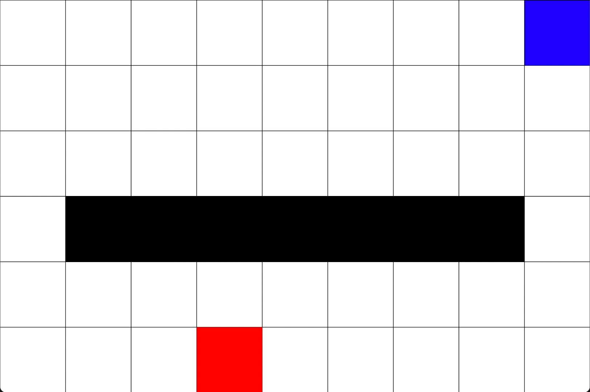

# Sutton's Shortcut Maze with Dyna-Q and Dyna-Q+

      Before shortcut opens        Dyna-Q after shortcut opens    Dyna-Q+ after shortcut opens

  
  
  

This problem aims to compare and discuss the control methods of Dyna-Q and Dyna-Q+, and their effects on training under various heurisitics and parameter settings.

This solution was written in C++ as main language, on Xcode 13.X platform. Visualization of race track requires installation of the SFML packages.
Unit testings were carried out using XCTest as well. All modules have tests except the visualization module, which cannot be supported by XCTest.

## Problem Statement:
A maze grid world is set up, initially as shown below on left. The agent The optical path would need to go around the left side of the barrier (upper left). After 3000 time steps, however, a shorter path is opened up along the right side, without disturbing the longer path (upper right).

We would like to try out both Dyna-Q and Dyna-Q+ control methods on this problem, to observe and compare their training results and experiment on their heuristics and parameters.

## Solution Overview:
For the Dyna-Q control method, we straightforwardly follow the algorithm layed out in Sutton's book. After each training step in real experience, we also apply 50 steps of planning, continuing the state-action value updates in the background under simulated experience. The simulated experience are random fragments from all past real experiences "remembered" by an environment model, both deepening the results from real experience, and also back-propagating the training progress of later time steps towards earlier steps, making highly-efficient usage of all real interaction experience with the actual environment.

The Dyna-Q+ control method takes advantage of the high degree of freedom in planning, adding heuristics into the planning steps. One obvious such heuristics is to aribitrarily add a small bonus reward to actions that have not been picked for a long time, since models corresponding to these actions have the highest chance of having changed. The addition of such bonus reward encourages the exploration of not just untried actions, but also rarely visited environment models. 

Depending on how the heurisitic is implemented, Dyna-Q+ can even encourage long sequences of rarely visited state-actions to explore entirely new solutions. Such feature is required to find the new shortcut in maze for our problem. Otherwise, the trained greedy policy will stick to the original longer path without even realizing the opening of a new shorter path. We will demonstrate and discuss all above situations under both control models and various hyperparameter settings.

## Essential Modules
Due to the highly standard structure of RL moduels used in our solution, we'll skip the description of code blocks in our discussion. The audience are welcome to look into the well-documented header files in code folder to gain further insights of the solution structure.

## Result discussion
###1. The sweetspot solution
Shown below is the training analysis for both Dyna-Q control, and Dyna-Q+ control under its "sweetspot" parameter (kappa for bonus reward) setting. Here our discount factor in training is gamma = 0.95, learning rate alpha = 0.1, soft policy factor epsilon = 0.1, with Dyna-Q+'s kappa = 5e-4. 

  
   

As can be seen in the left plot, the Dyna-Q+ agent was able to finish the first episode much sooner (319 steps) compared to the Dyna-Q agent's 642 steps, thanks to the artificial bonus reward encouraging more exploration of the policy and environment in the planning iterations. Afte the first episode, Dyna-Q agent quickly found the optimal solution as well, and maintained the optimal policy indefinitely. Meanwhile, although the Dyna-Q+ agent found the optimal path much quicker, the exploratory nature of the agent kept trying out sub-optimal paths, making the slope of accumulationg of rewards, as shown in the right plot, slower than Dyna-Q. Until after certain iterations, no bonus rewards can interfere with the optimal state-action values anymore, and the two agents align.

The drastic contrast between the Dyna-Q and Dyna-Q+ agents are most prominant after the maze opens up a shortcut at time step of 3000.

Our choice of parameter settings meaning that a time interval of ((0.95^16)/5e-4)^2 = 774850 steps would be needed to make our artificial bonus reward exceed the optimal policy at starting position, for the long path at the beginning setup of the maze.

